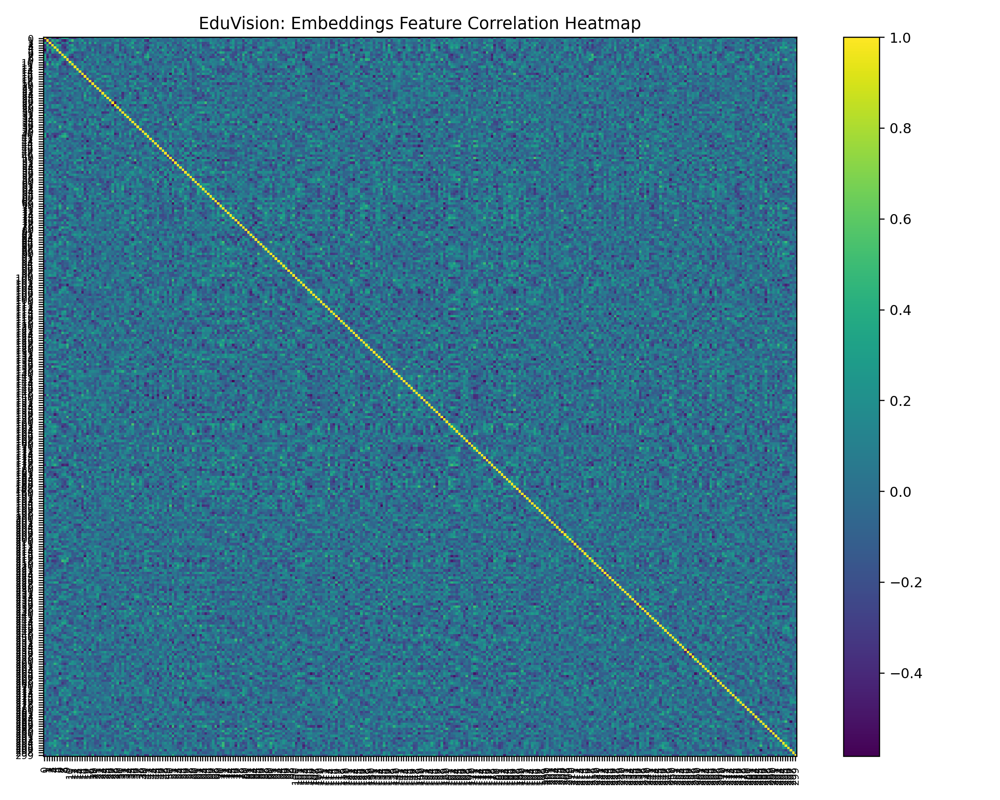

📚 EduVision — PDF Lecture Summarizer (Offline-friendly, SafeTensors)

Turn long lecture PDFs (local files or URLs) into clean summaries + notes—with optional OCR for scanned PDFs—using compact Hugging Face models that load via SafeTensors (no torch.load requirement).

✨ What it does

✅ Extracts text from vector PDFs (PyPDF2)

🔄 Falls back to OCR for scanned/photographed PDFs (pdf2image + Tesseract)

🧩 Map–Reduce summarization for long documents

📝 Generates short / medium / long summaries

🔹 Creates bullet notes + key phrases

💾 Saves all outputs to a folder you choose

🧱 Tech Stack

Python 3.9–3.12

PyPDF2 for text extraction

pdf2image + Tesseract (optional OCR)

Transformers + SafeTensors models (e.g., t5-small, bart-base)

Torch CPU/GPU (no need for v2.6+ due to SafeTensors path)

📂 Repo / Script Layout
eduvision_pdf_summarizer/
├─ pdf_lecture_summarizer.py     # main script (safetensors-first)
├─ README.md                     # this file
└─ outputs/                      # summaries, notes, metadata will appear here

🔧 Installation

Windows-focused; works on macOS/Linux too.

Python packages:

pip install transformers torch sentencepiece PyPDF2 pdf2image pytesseract pillow requests

(Optional, for OCR fallback)

Tesseract: install and ensure tesseract.exe is on PATH

Windows: search “Tesseract OCR Windows UB Mannheim” build

poppler: install and add poppler\bin to PATH

Windows builds available (e.g., conda install -c conda-forge poppler)

If you don’t need OCR (your PDFs have selectable text), you can skip Tesseract + poppler.

▶️ Usage

Open pdf_lecture_summarizer.py and set the input:

PDF_SOURCE = r"C:\Users\sagni\Downloads\Edu Vision\R20CSE2202-OPERATING-SYSTEMS.pdf"
# or
# PDF_SOURCE = r"https://arxiv.org/pdf/1706.03762.pdf"

Run:

python pdf_lecture_summarizer.py

Outputs (default)

Saved to:

C:\Users\sagni\Downloads\Edu Vision\outputs

You’ll get:

<name>_text.txt — extracted full text

<name>_summary_short.txt (≈120 words)

<name>_summary_medium.txt (≈250 words)

<name>_summary_long.txt (≈500 words)

<name>_notes.md — concise bullet notes

<name>_meta.json — metadata (model used, word counts, key phrases, etc.)

🧠 How it works

Extract text

PyPDF2 tries regular text first

If it finds too little: OCR fallback (pdf2image → Tesseract)

Chunk the text (e.g., 1200 words per chunk + 150 overlap)

Map–Reduce summarization

Summarize each chunk → combine partials → summarize again

Post-processing

Create bullet notes and key phrase list

Save artifacts

⚙️ Config knobs (top of script)
# Model candidates (safetensors-first; small → larger)
MODEL_CANDIDATES = [
    ("t5-small", 1280),            # fast & light
    ("facebook/bart-base", 1536),  # better quality, a bit larger
]

DEVICE = "cpu"   # set "cuda" if you have GPU
SHORT_MAX_WORDS  = 120
MEDIUM_MAX_WORDS = 250
LONG_MAX_WORDS   = 500
CHUNK_WORDS      = 1200
CHUNK_OVERLAP    = 150

ENABLE_OCR_FALLBACK = True
OCR_DPI = 250

Want higher-quality summaries? Add a bigger model (e.g., facebook/bart-large-cnn) after the small ones—but it’s heavier to download. SafeTensors is still preferred.

🛠 Troubleshooting
“Requires torch >= 2.6 due to CVE”

You’re safe—this script forces SafeTensors (use_safetensors=True), which doesn’t use torch.load. No need to upgrade Torch.

Slow or flaky model downloads (Windows)

Add: pip install "huggingface_hub[hf_xet]" (faster big-file fetch)

Set a dedicated cache dir:

os.environ["HF_HOME"] = r"D:\hf_cache"

We already disable symlink warnings:
os.environ["HF_HUB_DISABLE_SYMLINKS_WARNING"] = "1"

OCR doesn’t work

Ensure both Tesseract and poppler are installed and on PATH

Try increasing OCR_DPI to 300

Output looks too short/long

Tweak SHORT_MAX_WORDS, MEDIUM_MAX_WORDS, LONG_MAX_WORDS

For very large PDFs, reduce CHUNK_WORDS to 800–1000

🔬 Quality Tips

If summaries feel generic, move ("facebook/bart-base", 1536) to the top of MODEL_CANDIDATES.

For highly technical PDFs, try facebook/bart-large-cnn (heavier) or domain-specific models from Hugging Face.

🧪 Example
# Local academic notes
PDF_SOURCE = r"C:\Users\me\Downloads\OperatingSystems_Notes.pdf"
main(PDF_SOURCE)

# Online lecture slides
PDF_SOURCE = r"https://example.edu/course/lecture03.pdf"
main(PDF_SOURCE)

Outputs:

OperatingSystems_Notes_text.txt
OperatingSystems_Notes_summary_short.txt
OperatingSystems_Notes_summary_medium.txt
OperatingSystems_Notes_summary_long.txt
OperatingSystems_Notes_notes.md
OperatingSystems_Notes_meta.json

🔗 Extending this

Quiz Generation: bolt on a QG model after summaries (MCQs, T/F)

Mind-Maps: export key phrases into a graph (e.g., pyvis)

UI: wrap with Streamlit or FastAPI + React for a friendly dashboard

Batch mode: loop through a folder of PDFs and summarize all
Author
SAGNIK PATRA
